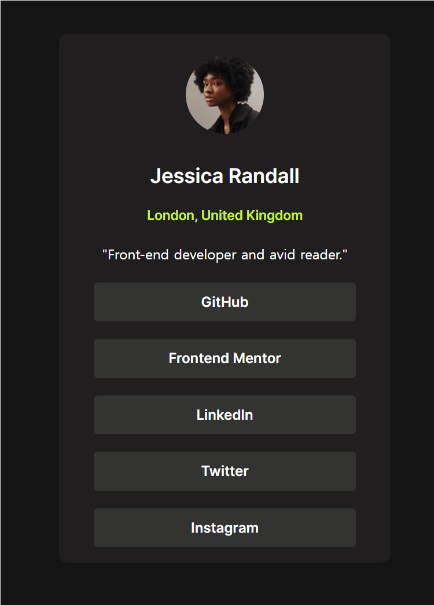

# Frontend Mentor - Social links profile solution

This is a solution to the [Social links profile challenge on Frontend Mentor](https://www.frontendmentor.io/challenges/social-links-profile-UG32l9m6dQ). Frontend Mentor challenges help you improve your coding skills by building realistic projects.

## Table of contents

- [Overview](#overview)
  - [The challenge](#the-challenge)
  - [Screenshot](#screenshot)
  - [Links](#links)
- [My process](#my-process)
  - [Built with](#built-with)
  - [What I learned](#what-i-learned)
  - [Continued development](#continued-development)
  - [Useful resources](#useful-resources)
  - [AI Collaboration](#ai-collaboration)
- [Author](#author)

## Overview

### The challenge

Users should be able to:

- See hover and focus states for all interactive elements on the page

### Screenshot




### Links

- Solution URL: [Add solution URL here](https://github.com/SuaJeong-winter/FEM-03-social-links-profile)
- Live Site URL: [Add live site URL here](https://suajeong-winter.github.io/FEM-03-social-links-profile/)

## My process

### Built with

- Semantic HTML5 markup
- CSS custom properties

### What I learned

- I practiced CSS properties "display"

````

```css
/* Make adjacent links stack with 15px spacing */
article a {
  display: flex;
  align-items: center;
  justify-content: center;
  height: 45px;
  border-radius: 5px;
  margin: 10px 40px;
  font-family: "Inter";
  text-decoration: none;
}

article a:hover {
  background-color: var(--green);
  color: var(--grey900);
  font-family: "Inter";
}

````

### Continued development

- I added hover effects on every <a> tag (github, frontend mentor, linkedin, twitter, Instagram)

### Useful resources

- [MDN docs](https://developer.mozilla.org/en-US/docs/Web/CSS/Reference/Properties/display) - It's like my CSS dictionary.

### AI Collaboration

Describe how you used AI tools (if any) during this project. This helps demonstrate your ability to work effectively with AI assistants.

- What tools did you use (e.g., ChatGPT, Claude, GitHub Copilot)?
- How did you use them (e.g., debugging, generating boilerplate, brainstorming solutions)?
- What worked well? What didn't?

**Note: Delete this note and the content above if you didn't use AI, or replace with your own experience.**

## Author

- Website - [Jeong Sua 정수아](https://github.com/SuaJeong-winter)
- Frontend Mentor - [@SuaJeong-winter](https://www.frontendmentor.io/profile/SuaJeong-winter)
